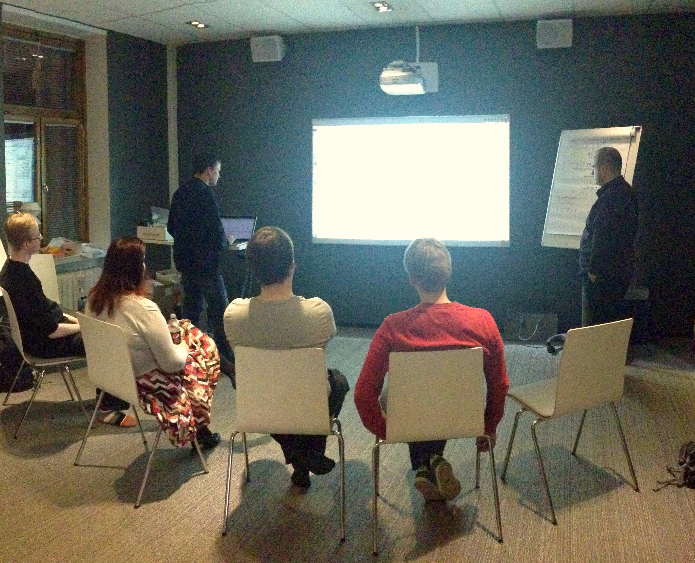

# What is Mob Programming?

> All the brilliant people working on the same thing, at the same time, in the same place, and on the same computer. -- Woody Zuill

Mob programming is a software development approach where the whole group of people works together using a shared computer, with focus on real-time contribution from everyone to get the best out of them into the work they are doing.

*Image: Mob Programming at Tech Excellence Meetup in Finland. Author of the book is second from left sitting down.*

The work done can be targeted at writing code - all the activities around programming. The work done can be targeted at finding information - all the activities around testing. The work done can be targeted at creating written instructions - all the activities around documenting.

Since the activity with mob programming does not have to be programming, you will find we often use the term *mobbing* as a shorthand.

When the team works together using one computer, this guides the team to work on a single work item at a time. With increased communication and learning, quality of end result improves on the spot and many of the problems around distributing work to different people can be resolved on the spot. There's less back and forth and a shared drive to deliver consistently, and a group will improve whatever is slowing them down.

## The Basic Dynamics

For the group to work together, we use basic roles and rules.

Roles:

* **Driver** is the person at the keyboard. No decisions allowed.
* **Navigators** are the people off the keyboard. They are the ones doing the work by using their words to express intent the driver turns into action.
* **Designated Navigator** is one navigator channeling the group to the driver. This role is often necessary when first starting to practice mob programming and dissolves later.

Rules:

* **Rotate on timer**. Whoever is on the keyboard moves away and makes space for the next one. Timer is in scale of minutes.
* **Yes, and**. Whatever we were doing when we rotated, we continue and improve. We don't erase previous work.
* **No decisions on the keyboard**. This is not a group watching one work. Whatever happens at the keyboard is initiated from navigators.
* **Navigate on highest level of abstraction driver can consume**. Tell your intent as a navigator. If more is needed, you see it from the lack of movement at the keyboard.
* **Bias to action**. Favor doing something and being ready to throw it away over discussing in length between options.
* **Kindness, consideration and respect**. We're working closely together and we are all valuable contributors. Make space for everyone to shine.

## Why Would You Have 5-8 People on One Thing?

Many people look at mob programming and wonder on why would we use so many people to do the work one or pair could do. Their concern is that this way of working would be inefficient. However, that is not the experience of those who practice mob programming.

You need to think of software work in a completely different way. Typing the code is not programming. Creating a solution that stands the test of time in production is. Quality of what we produce matters - in the immediate solution, the supporting structures created to make it available for users, and the people's abilities who produce more software later.

Instead of thinking about how we can get the most out of our team, we ask how we can get the best out of our team. Getting people together on a particularly difficult problem, swarming, had been used before. When Woody Zuill and his team at Hunter Industries moved from temporary group work to group work being the default way of working throughout the work week, Mob Programming was born. They realized that paying attention to what was working well and doing more of it created a whole new approach to developing software. 

Many teams bring a group of people together on tough problems. Most teams after coming together to solve a problem say "Problem solved, let's go back to normal". Mob programming asks "We had very high performance together, how can we do more of that?".

## Immediate Feedback

When we work alone, the best and the worst of us ends up in the code or the work artifact we are creating. When someone joins in later and reviews, they help correct some of the stuff, making priority calls.

When we work as a group, the best of each one of us end up in the code or the work artifact we are creating. We can correct mistakes when they are about to happen, without egos in play. Often our best is better in a group than our best alone as group generates ideas that would not emerge working alone.

Working in a mob can be particularly rewarding for team members whose programming skill is less evolved. They still have great ideas even if they have little ability to turn it into production code alone and we would like the best ideas to end up into the software we are building.

## Learning or Contributing

For mob programming, we say the right size of a group is one where everyone is still either learning or contributing. Contributing raises the quality of the code or the work artifact we are creating. Learning raises the quality of the people contributing the code or the work artifacts. People, having learned in a mob, are better off working on similar activities solo.

Two people are a pair. Three and above are a mob. Moving from a pair to a group changes the interpersonal relationships, and we find that people who misbehave in a pair are on better behavior in a group. More people maximize the chance of serendipitous learning from the other members in the group.

Mob programming is a software development method - all code is produced in mob. When the team works, they work together. Mob programming goes beyond a timeboxed practice session. It's what mob programming teams do, all day, every day.

Other teams use mob programming within a time box. They work solo or in pairs except for mob programming sessions introduced to share knowledge amongst team members.

Consultants and trainers have found mob programming to be an effective way to teach groups of people habits and hands-on skills. Facilitating a mob allows the facilitator to impact the work as it is done instead of discussing an experience of doing something in the abstract.

## Benefits of High communication

When we are mob programming, we are all working on the same thing together. If we need help - whether we know to ask for it or not - it is available within the group immediately within the work we are doing.

When we work, we often make mistakes. Maybe we misunderstand a detail of what is required. Maybe we forgot to think about an aspect that would be relevant. If I make a mistake working solo and don't notice it myself, I will compound the mistake and build more on top of it until it gets corrected. And if I have used significant time building on top of that mistake, correcting it makes me defensive.

The just-in-time knowledge mob programming offers changes the dynamic. The mistakes people would correct get corrected in the moment, before the mistake reaches the code or the work artifact. Learning is turned up by the fact that you can learn things you know you don't know, but mob programming guides you to learning things you did not yet know you could be learning.

Cost of rework we can track. Cost of delays of knowledge is mainly hidden. If the hours we waste because of gaps in knowledge or understanding were accounted for, there would be less resistance to mob programming.
